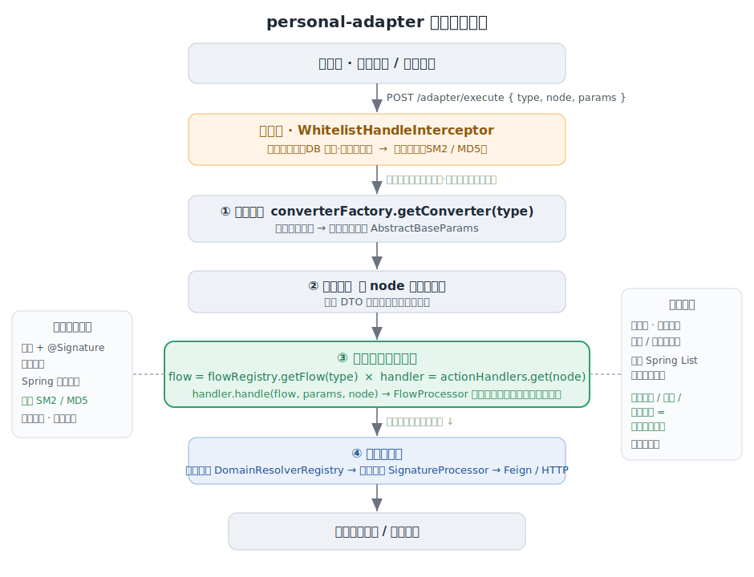

# personal-adapter · 无网关的多方对接适配框架

统一一个入口，把「对接各种外部系统」做成可插拔、只做加法的框架内核：接新系统、换加签算法、加业务动作，基本只往里加实现，不动核心代码。

> 个人 demo，已脱敏，配置与密钥均为占位值，用于展示设计与代码风格，不能直接运行。

## 解决的痛点
对接的外部系统越来越多（POS、支付、会员、发票…），朴素做法每接一个都要重复一整套流程，问题集中在：

1. 「控制器 → 参数转换 → 加验签 → 校验 → 调下游」整套重复复制，代码冗余、风格不一，维护成本高；
2. 各方加签 / 加密算法不同（MD5、SM2…），散落各处，难统一、难替换；
3. 每接一个新系统都要改动核心流程，牵一发动全身，回归范围大、易引入 bug；
4. 若统一走 API 网关，多一层网络与运维、成为单点，且 `type + node` 这种业务级路由在网关里表达别扭；
5. 各处异常各写各的，对外错误码 / 语义不统一，联调排障低效。

## 技术栈 & 模块
- **技术栈**：JDK 17 · Spring Boot · Spring Cloud OpenFeign · Spring Cloud Tencent Polaris（注册 / 配置 / 服务治理）· Redisson · RocketMQ · OSS 对象存储 · MyBatis · 国密 SM2
- **模块**：`personal-adapter-api`（对外接口）· `personal-adapter-dto`（DTO / 注解）· `personal-adapter-service`（框架内核 + 各方适配实现）

## 设计亮点

> [!TIP]
> **设计模式**：策略 · 工厂 · 注册中心 · 模板方法 · 拦截器 · 注解驱动配置

- **无网关 · 二维分发**：统一入口 `POST /adapter/execute`，按 `type × node`（哪个系统 × 哪个动作）在应用内路由，省掉网关这层单点和网络开销；两条维度彼此解耦，加系统不碰动作、加动作不碰系统。
- **注册中心 · 启动即装配**：流程、节点、域名解析在启动时注册进各自注册表（`*FlowRegistry` / `*NodeRegistry` / `DomainResolverRegistry`），运行时按 `type` / `node` 直接查表分发；新增对接方把自己的流程和节点注册进去即可，入口和核心都不用改。
- **加解密可插拔**：加验签用「策略模式 + `@Signature` 注解声明 + Spring 自动装配」，内置国密 **SM2**、MD5；加一种算法只写一个实现类，核心零改动。
- **只做加法扩展**：转换器、签名策略、节点 / 流程注册表都靠 Spring `List` 注入自动收集，没有中心化清单要维护，新增系统 / 动作 / 算法基本只落在一个新文件、回归范围小。
- **报文归一**：转换器把各方异构报文统一成内部模型，业务层不感知外部差异。
- **横切前置**：白名单、验签放在拦截层，业务代码只处理「已鉴权、已验签」的干净请求；对外错误按语义分级（验签失败 / 校验失败 / 无渠道 / 不支持）。

## 带来的效果

| 指标 | 优化前 | 优化后 | 效果 |
|---|---|---|---|
| 接入一个新渠道工时 | 约 25 人天 | 约 15 人天 | ↓ 约 40% |
| 适配层重复代码 | 每方各写一套 | 转换 / 验签 / 校验 / 错误全下沉内核 | ↓ 约 45% |
| 对接相关线上异常率 | — | 统一校验 + 验签 + 语义化兜底 | ↓ 约 35% |
| 新增加签算法 / 业务动作 | 改核心多处、回归面大 | 加 1 个类 + 注册 | 接近 0 回归 |
| 多渠道并行对接 | 改同一份核心、需串行、易冲突 | 各渠道独立扩展、互不影响 | 支持多人并行，协作冲突大幅减少 |

## 一次请求怎么走

前面几点是设计层面的取舍，落到运行时是怎么串起来的，跟着一次请求从进来到出去走一遍最直观。



对外只有一个入口 `POST /adapter/execute`，请求体是 `{ type, node, params }`。`type` 定位是哪个系统、`node` 定位是哪个动作，剩下的转换、校验、验签、分发都由框架按这两个维度自动完成。

```java
@RestController
@RequestMapping("/adapter")
public class AdapterUnifiedController implements IAdapterUnifiedApi {
    private final BaseFlowManagerFactory flowManagerFactory;

    @PostMapping("/execute")
    public Object executePFlow(@RequestBody @Valid BaseUnifiedRequest request) throws Exception {
        return flowManagerFactory.executeFlow(request.getType(), request.getNode(), request.getParams());
    }
}
```

进来之后大致是这么几步：

- **进 controller 之前**，拦截器（`WhitelistHandleInterceptor`）先做白名单和入站验签。把这类横切的事放拦截器，
  业务代码拿到的永远是已经鉴权、验过签的请求。白名单按 `accessType`（内部/外部）加渠道从数据库读，支持热刷新，
  外部来调和内部调用共用同一套基建。
- **到 `executeFlow` 里**：先按 `type` 找到对应的参数转换器（`converter.supports(type)`），把各家报文转成内部统一模型；
  再按 `node` 选校验分组做校验；最后按 `type` 拿到流程、按 `node` 拿到动作处理器，把动作派发到对应方法。
  某个系统没实现某个动作，就抛 `UnsupportedOperationException`，返回「不支持该动作」，而不是直接 500。

```java
public <T extends AbstractBaseParams, R> R executeFlow(ServiceType type, BaseNode node, Object params) {
    BaseParamsConverter<T> converter = converterFactory.getConverter(type);   // 按 type 选转换器
    T converted = converter.convert(type, node, params);                      // 报文 → 内部统一模型
    BizPreconditions.checkState(ObjectUtils.isNotEmpty(converted.getBizData()), PARAM_VALID, "BIZ_DATA 不能为空");
    Class<?> group = validationProcessor.getValidationGroup(node);            // 按 node 选校验分组
    validationProcessor.validate(converted.getBizData(), group);
    UnifiedInternalServiceFlowProcessor<T> flow = flowRegistry.getFlow(type);  // 按 type 取流程
    BaseNodeHandleStrategy handler = actionHandlers.get(node);                 // 按 node 取动作处理器
    BizPreconditions.checkState(handler != null, NODE_NO_FOUND, "不支持的调用动作");
    return (R) handler.handle(flow, converted, node);
}
```

- **如果是对外调下游**：先解析目标域名（`DomainResolverRegistry`），加签（`SignatureProcessor`），再用 Feign/HTTP 发出去。

「按 type 选流程」和「按 node 选动作」是两个独立维度：加一个新系统不用碰任何动作，加一个新动作也不用碰任何系统，不会随着规模变成一堆 if/switch。

## 加东西只做加法

**加一种加/验签算法**：签名算法是个策略接口，实现类交给 Spring，`SignatureStrategySelector` 启动时把容器里所有策略
按类型收进一个 map；参数类上用 `@Signature` 注解声明用哪种。

```java
public interface SignatureStrategy {
    String calculate(SignatureParam params, RequestContext ctx);
    String getStrategyType();          // "SM2" / "MD5" ...
}

@Signature(strategy = "SM2")           // 参数类上声明即可
public abstract class AdapterBaseSignParam implements SignatureParam { ... }
```
想加个 RSA，就写一个 `@Component` 实现 `SignatureStrategy`、`getStrategyType()` 返回 `"RSA"`，再把某个参数类改成
`@Signature(strategy="RSA")` 就行，核心和其它算法都不用动。目前内置了 SM2（国密）和 MD5。

**接一个新系统 / 加一个动作**：每类对接实现一个流程处理器，声明自己支持哪些 node；注册中心启动时收集，入口按 node 分发过来。

```java
public interface ExternalProductFlowProcessor extends UnifiedExternalServiceFlowProcessor<Object> {
    Object pluAll(Object params);
    Object getComboDetail(Object params);
    // ...
}

public interface UnifiedExternalServiceFlowProcessor<T> {
    Object execute(ExternalBaseNode node, T params);
    Set<ExternalBaseNode> getSupportedNodes();   // 支持哪些 node，注册中心据此装配
    String getProcessorType();
}
```

之所以能一直「只加不改」，是因为装配全靠 Spring 的 `List<T>` 注入加按类型/谓词自选：写一个 bean 就自动被收集，
没有一份中心化的注册清单要维护，改动基本只落在新加的那个文件里。

## 几个设计上的取舍

| 做法 | 考虑 | 代价 |
|---|---|---|
| 不走网关，应用内按 type+node 分发 | 少一层网络和单点，业务级路由写在代码里更直观、好测 | 跨语言复用不如网关，得自己维护注册和分发 |
| 加验签用策略 + 注解 + 自动装配 | 算法可换、声明式、新增不侵入 | 是「约定优于配置」，新人得先了解 @Signature 的约定 |
| 各方报文先转成内部统一模型 | 业务层只面对一种模型，外部差异被挡在外面 | 每接一方要写一个转换器 |
| 白名单、验签放拦截器 | 业务代码只处理干净请求 | 拦截链顺序要安排好 |
| 配置放数据库 + 热刷新 | 改行为不用发版 | 要注意配置一致性 |

## 内核结构 `com.personal.demo.rule`

```
com.personal.demo.rule
├── convert/       报文 ↔ 内部统一模型
├── db/            密钥 / 白名单 / 流程映射等配置的读取
├── factory/       流程管理器、转换器、请求处理策略的工厂
├── flow/          内外部流程处理器契约
├── handler/       处理器管线：验签、参数校验、白名单拦截、策略选择器
├── initalizer/    启动时的节点、流程映射、校验分组初始化
├── registry/      注册中心：流程注册表、节点注册表、域名解析注册表
├── strategy/      策略：签名(SM2/MD5)、请求处理、节点处理
└── validation/    分组校验
```

## 文档
- 使用说明：[适配器使用规则](personal-adapter/适配器使用规则.md)
- 设计说明：[适配器设计](personal-adapter/适配器设计.md)
